

  

<h1 align="center">Telegram ToDo bot</h1>

Учебный проект, telegram бот для работы со списками задач.

    
    
    
    
    
    

## Реализовано

### Базовые возможности

| № | Описание                       | Скриншоты (en)                                    | Скриншоты (ru)                                    |
| - |--------------------------------|---------------------------------------------------|---------------------------------------------------|
| 1 | Добавление новых задач         | 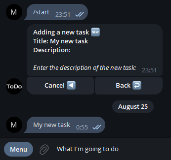    | 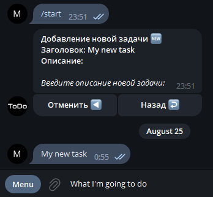    |
| 2 | Удаление задач                 | 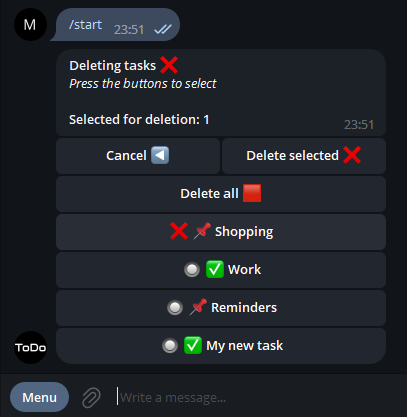 | 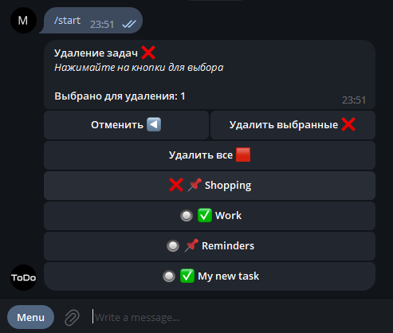 |
| 3 | Отметка задач, как выполненных | 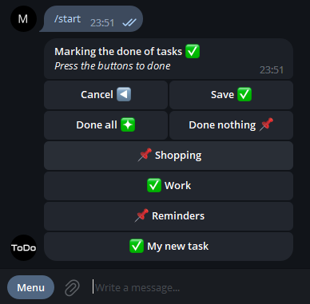   | 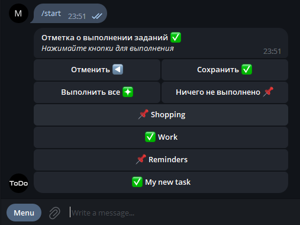   |
| 4 | Редактирование задач           | 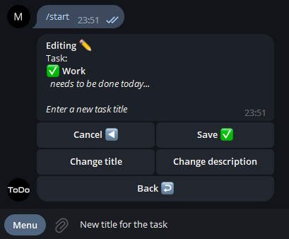   | 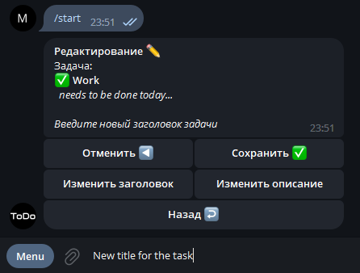   |

### Особенности

| № | Описание                                      | Скриншоты (en) | Скриншоты (ru) |
| - |-----------------------------------------------|----------------|----------------|
| 1 | Локализация бота                              | —              | —              |
| 2 | Основное управление ботом через inline кнопки | —              | —              |

### Управление

Доступна панель администратора для управления пользователями и просмотра статистики.

| № | Описание                                                                                                                                                                                                                                                                                        | Скриншоты (en)                                                                                                      | Скриншоты (ru)                                                                                                      |
| - |-------------------------------------------------------------------------------------------------------------------------------------------------------------------------------------------------------------------------------------------------------------------------------------------------|---------------------------------------------------------------------------------------------------------------------|---------------------------------------------------------------------------------------------------------------------|
| 1 | **Пользователи:** просмотр списка пользователей бота по страницам (пагинация) — сортировка пользователей: по дате регистрации, по числу задач, числу выполненных; поиск пользователя по его данным (через отправку сообщений); возможность блокировать / разблокировать доступ для пользователя | 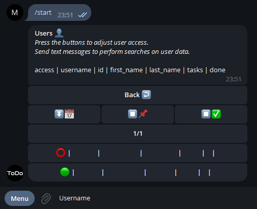                                                             | 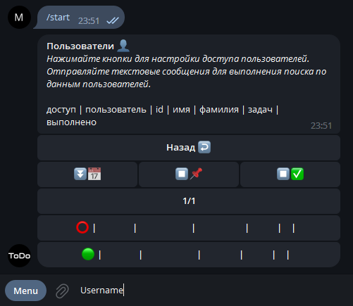                                                             |
| 2 | **Статистика:** вывод статистики по количеству событий  (callback / state) на таймлайне, возможность получить результат в различных форматах, оповещение о процессе формирования и визуализации статистики, регулирование временного интервала (для *.HTML интерактивно)                        | 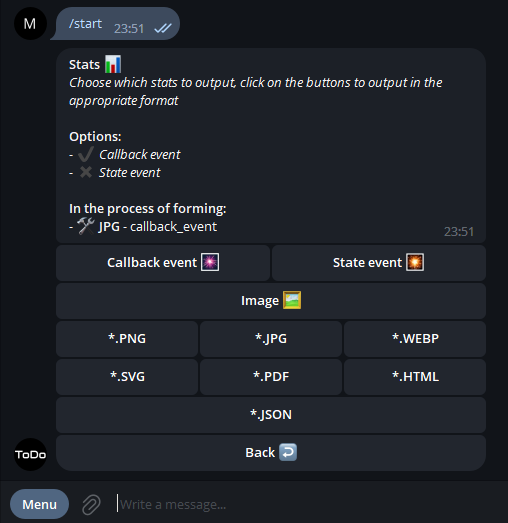 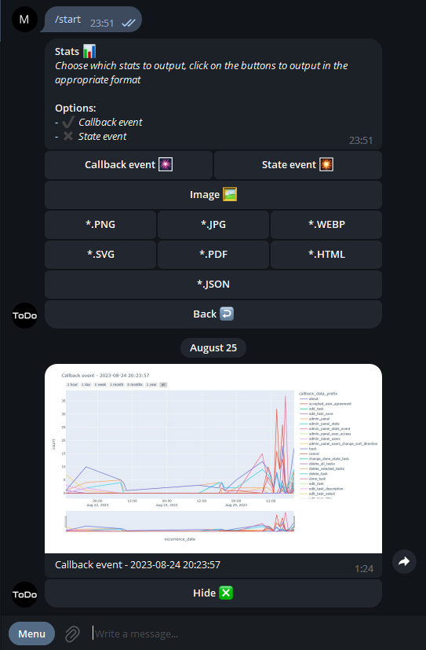 | 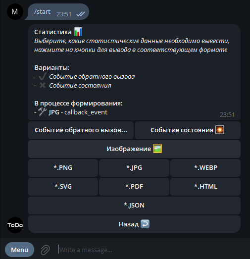 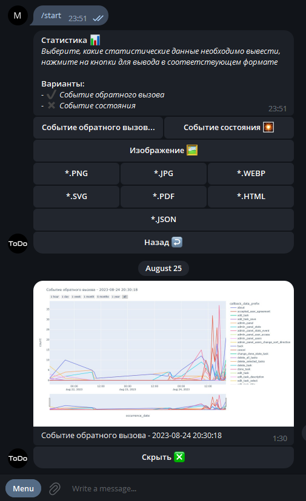 |

### Ограничения

| № | Описание                                                                                                                                           | Скриншоты (en)                                 | Скриншоты (ru)                                 |
| - |----------------------------------------------------------------------------------------------------------------------------------------------------|------------------------------------------------|------------------------------------------------|
| 1 | Доступ к admin панели и всем её функциям есть только у администратора                                                                              | —                                              | —                                              |
| 2 | Всем пользователям доступно место для хранения не более 20 задач одновременно                                                                      | 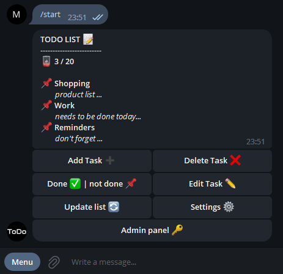     | 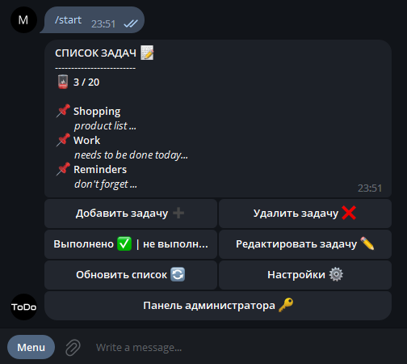     |
| 3 | Пользователь, заблокированный администратор не имеет доступа к функционалу бота, на любое действие получает сообщение о блокировки                 | 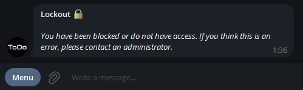  | 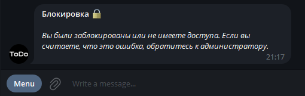  |
| 4 | Для доступа к функционалу бота пользователь должен принять пользовательское соглашение, в дальнейшем оно будет доступно для прочтения в настройках | 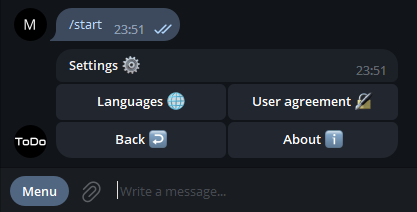 | 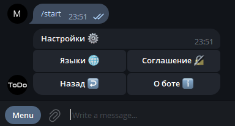 |

## Реализация в перспективе

1. Локализация на большее число языков.
2. Сортировка, фильтрация, поиск по задачам.
3. Указание сроков для задач, напоминания об истечение срока, авто выполнение при истечение срока.
4. Admin panel: большая гибкость управления пользователями, назначения ролей; больше типов статистики с возможностью кастомизации напрямую через бота.
5. Реализация списка задач для групп, групповое управление задачами, назначение задач для пользователя и т.п.
6. Вынесение логике в отдельный сервис для реализации для других интерфейсов и интеграции со сторонними сервисами.
7. Внедрение моделей искусственного интеллекта для более гибкой аналитики бота, интуитивного упорядочивание задач, текстовых рекомендаций по улучшению рабочего процесса для пользователя на основе его ведения списка задач.
